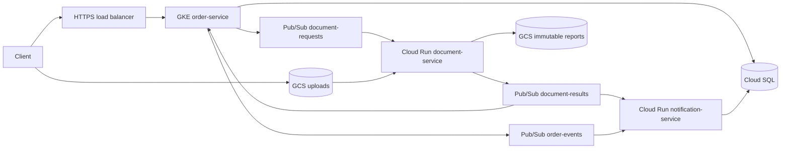

# Phase 1 — Accepted architecture baseline

A B2B supplier accepts order documents, validates their bytes, calculates checksums, writes JSON metadata reports, and independently records audit/notification intent. OCR, malware scanning, and actual email/SMS delivery are outside the initial processor.

## Decisions to preserve during implementation

- Java 21, Boot 4.1.1, Spring Framework 7, Maven; one GCP region initially.
- Regional GKE Autopilot hosts order API, polling outbox relay, and streaming result subscriber.
- Document and notification services use authenticated Cloud Run push endpoints and separate subscriptions.
- Notification creates durable records; it does not claim email/SMS delivery.
- Order and notification use separate logical databases/users on one Cloud SQL PostgreSQL instance. No cross-service SQL joins. The document processor has no SQL access.
- Orders and document registrations are tenant-scoped. Verify issuer, audience, scopes, and resource ownership.
- `POST /orders`, `GET /orders/{id}`, controlled `PATCH /orders/{id}/status`, document registration/read, and explicit document `/complete` operations use `/api/v1`.
- Registration creates AWAITING_UPLOAD. Direct signed GCS upload is followed by verification; `/complete` atomically writes QUEUED, exact object generation, and request outbox event. Initial size ceiling: 25 MiB.
- Document state: AWAITING_UPLOAD -> QUEUED -> PROCESSED/FAILED; abandoned uploads expire. Authorized reprocessing uses a new processingRequestId. No potentially stale PROCESSING state initially.
- SQL mutation plus outbox row commit together. Relay claims short leases, publishes outside the SQL transaction, and marks publication with a claim token. Duplicate publication reuses eventId.
- The processor writes a create-only canonical GCS result keyed by processingRequestId, then publishes its stored stable result event before acknowledging. Concurrent workers reuse the winning result. Transient failures cause redelivery; invalid document bytes produce durable terminal failure results.
- SQL consumers atomically insert unique (consumerName,eventId) plus business effect, then ACK. Stale processingRequestId results cannot overwrite current state.
- Independent topics: order-events, document-requests, document-results. Result consumers have separate subscriptions. At-least-once delivery, no assumed global ordering.
- Dead-letter topics require retained subscriptions, IAM, alarms, and controlled replay. Reconcile aged QUEUED work. Deduplication/result retention must cover replay windows.
- GCS object generations and create-only preconditions prevent overwrite races. Signed URLs are short-lived bearer capabilities and are never logged.
- Workload Identity Federation for GKE and dedicated Cloud Run identities eliminate static service-account keys. Push invocation identities are distinct from runtime identities.
- Private Cloud SQL connectivity uses the Java connector plus HikariCP. Notification uses Direct VPC egress. The connector does not create network reachability.
- Combined connection budget includes API replicas, notification maximum instances, pool sizes, rollouts, and admin headroom. Document workers consume zero SQL connections.
- Production uses SQL HA/backups and regional app resilience; regional disaster recovery is additional work.
- Trace context crosses events; logs exclude document bytes, secrets, and signed URLs. Monitor outbox age, backlog age, dead letters, processing latency, and pool wait time.
- Local development uses PostgreSQL, Pub/Sub Emulator, and a GCS-specific fake. GCS is not AWS S3; emulators do not prove IAM, signed URL, failover, or real network behavior.

## Trade-offs

GKE suits continuous relay/subscriber work but has a provisioned cost baseline. Cloud Run suits request-bounded processing but requires concurrency and downstream capacity caps. Shared SQL reduces cost and shares outage risk. GCS/SQL/Pub/Sub are separate transaction boundaries; convergence relies on durable records and idempotent retries, not distributed transaction annotations.

## Interview Takeaway

Identify every commit boundary and make recovery safe between boundaries. Managed infrastructure does not remove application responsibility for business consistency.
