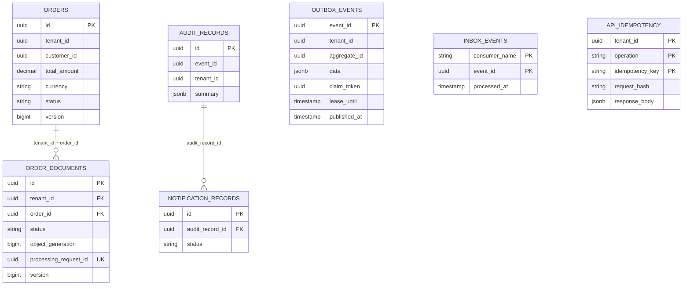

# Phase 3 — Domain and database

## Ownership and scope

The order service owns `orders`, `order_documents`, `outbox_events`, `inbox_events`, and `api_idempotency`. Notification
owns a separate database containing `inbox_events`, `audit_records`, and `notification_records`. The document processor
has no SQL connection. Database names/users are deployment inputs, not migration-created infrastructure.

One Cloud SQL instance may host both databases initially, but neither service receives credentials for the other's
database. This remains a shared capacity/failure boundary. No cross-database foreign keys or SQL joins are used.



Outbox and idempotency references intentionally have no aggregate foreign key: their retention and replay lifetimes
differ from the aggregate. Each database has its own inbox; the diagram shows its common structure, not a shared table.

## Business model

`Order` records a customer reference, external customer identifier, declared purchase-order total, currency, and
business status. This is a document workflow, not a pricing/inventory engine; there are no order-line, payment, or stock
models yet. The authenticated customer/tenant relationship will be checked by the application layer in Phase 4.

Supported currencies are USD, EUR, GBP, and INR, all represented with two decimal places.
`BigDecimal.setScale(2, UNNECESSARY)` rejects fractional amounts that require rounding. `numeric(19,2)` and Java
validation impose the same positive magnitude bounds. Additional currencies require an explicit minor-unit policy.

Order transitions:

```text
CREATED -> CONFIRMED -> FULFILLED
   |           |
   +-----------+----> CANCELLED
```

Repeating the current status is a no-op. Terminal statuses cannot be reopened. Document processing does not itself
confirm or fulfill an order. Cancellation does not retroactively delete an already submitted processing request; late
results remain useful for audit.

Document transitions:

```text
AWAITING_UPLOAD -> QUEUED -> PROCESSED
       |             |
       v             v
    EXPIRED        FAILED -> QUEUED (new processing request ID)
```

`VerifiedUpload` is constructed after storage inspection, not bound directly from an HTTP body. It includes the exact
GCS bucket/name/generation and verified size (1 byte through 25 MiB). The domain rejects mismatched objects and
completion at or after registration expiry. Upload URL expiry can be shorter than registration expiry; a future
authorization refresh must stay inside that window.

Successful and terminal failed attempts both reference a durable GCS report generation. Only successful processing
records a SHA-256. Transient infrastructure errors do not transition the domain to FAILED. Results for a different
request or an already terminal document return false without mutation. The Phase 5 handler must record/measure ignored
results and alarm on conflicting canonical outcomes.

Reprocessing clears the current report and failure fields and creates a new current attempt. Prior attempt history
remains in immutable GCS reports/events/audit records. A queryable SQL attempt-history table is a future extension if
support workflows need it. Processing request IDs must be newly generated; uniqueness of the current column alone does
not prevent reuse of an old historical ID.

Domain operations use constant time and space with bounded strings. Document streaming/checksum complexity belongs to
Phase 6.

## Persistence choices

- Domain objects are JPA entities within their owning service. A second identical persistence model would add conversion
  code without a demonstrated benefit. The deliberate cost is persistence annotations in the domain.
- Assigned UUIDs allow IDs to appear in outbox data before commit. Nullable `Long @Version` supports Spring Data's
  new-entity detection and prevents lost updates.
- `Instant` maps to PostgreSQL `timestamptz`. Timestamps are supplied explicitly for deterministic tests. Result
  completion uses local state-transition time; event occurrence time is retained separately in the envelope/audit.
- Money uses `numeric`, never binary floating point. Statuses use strings plus CHECK constraints, avoiding PostgreSQL
  enum evolution coupling.
- Documents reference an order ID rather than an ORM collection. PostgreSQL enforces the composite
  `(tenant_id, order_id)` foreign key against unique `(tenant_id, id)` on orders. This prevents cross-tenant attachment
  even through direct SQL.
- Entity reads are tenant-scoped. This is application isolation, not database row-level security; RLS would provide
  stronger defense with additional connection/session management requirements.
- `Slice` and `Pageable` support bounded document/audit reads; Phase 4 must enforce API page-size limits.
- JSONB is reserved for event data, stable response snapshots, and sanitized audit summaries. Queryable lifecycle fields
  are relational columns. Do not store signed URLs, tokens, raw documents, or unnecessary PII in these payloads.
- `persist` rather than `merge` appends outbox/idempotency/audit records. Reusing an immutable identifier must fail
  rather than rewrite history.
- Audit objects have no update API; database-level INSERT-only audit permissions arrive with the deployment
  IAM/database-role work. This is not a tamper-proof compliance archive.

## Constraints and indexes

Order document CHECK constraints explicitly test NULL/non-NULL combinations. PostgreSQL CHECK permits UNKNOWN, so
relying only on `generation > 0` would not enforce generation presence for QUEUED state.

Indexes are tied to access paths:

| Index                                              | Purpose                                                      |
|----------------------------------------------------|--------------------------------------------------------------|
| Orders `(tenant_id, created_at DESC, id)`          | Tenant-scoped pagination                                     |
| Documents `(tenant_id, order_id, created_at, id)`  | List order documents                                         |
| Partial document expiry/queue indexes              | Expiration and stuck-work reconciliation                     |
| Partial unpublished outbox index                   | Find due publication work without scanning published history |
| Published outbox / inbox / idempotency timestamps  | Bounded retention cleanup                                    |
| Audit `(tenant_id, aggregate_id, recorded_at, id)` | Tenant-scoped audit history                                  |

The outbox has stable event metadata plus JSON data. The Phase 5 publisher will assemble the wire envelope from these
stored values, without generating a new event ID or occurrence time on retry. Lease token, lease deadline, attempt
count, next availability, publication timestamp, and sanitized error code support the future relay. There is no relay
yet.

## Transaction boundaries

PostgreSQL READ COMMITTED is the initial isolation level. Use short application transactions, optimistic version checks,
and a scoped order row lock where an operation must serialize against order changes. Multi-row invariants cannot be
guaranteed by independent entity versions alone.

| Operation               | One database transaction                                               | Outside transaction                        |
|-------------------------|------------------------------------------------------------------------|--------------------------------------------|
| Create order            | Order + outbox + completed idempotency response                        | Authentication, request validation         |
| Change business status  | Version/transition check + order update + outbox                       | HTTP response                              |
| Register document       | Authorized parent/state check + document + stable idempotency response | GCS upload authorization/signing           |
| Complete upload         | Recheck registration/state + exact generation + QUEUED + outbox        | GCS metadata inspection before transaction |
| Apply processing result | Inbox insert + current request check + document mutation               | ACK after commit                           |
| Record notification     | Inbox insert + audit + notification intent                             | ACK after commit                           |
| Publish outbox          | Short claim transaction; separate success/reschedule transaction       | Pub/Sub call between transactions          |

These are the required application boundaries for Phases 4/5/8. Phase 3 implements persistence primitives and tests the
boundaries with real transactions; it does not yet expose use cases or consumers.

`OrderJournal`, `AuditJournal`, and `InboxStore` require `Propagation.MANDATORY`. Invoking them through Spring without
an existing transaction fails immediately. The enclosing application service will supply `@Transactional`. Do not call
them through manually instantiated objects or expect proxy interception on self-invocation.

### Concurrent inbox insertion

```sql
INSERT INTO inbox_events (consumer_name, event_id)
VALUES (?, ?)
ON CONFLICT (consumer_name, event_id) DO NOTHING;
```

The winner processes the event; a zero-row insert means this consumer already committed it. Concurrent inserts wait for
the competing transaction's outcome. If the winner rolls back, a retry can claim the event. The JDBC operation joins the
same datasource transaction as JPA through Spring's JpaTransactionManager. Tests verify rollback of the inbox and
business state together.

Do not catch a PostgreSQL uniqueness exception inside a failed transaction and try to continue using it. ON CONFLICT
avoids that problem for the inbox. API idempotency deliberately uses uniqueness: a concurrent losing create must roll
back the entire transaction, then reread the winning response in a new transaction. Matching fingerprint means replay; a
different fingerprint means HTTP 409 in Phase 4.

The idempotency operation must include resource scope (for example `POST:/api/v1/orders/{actual-id}/documents`), not
just a generic route template. Hash a canonical request representation, not arbitrary JSON property order. A stable
document response can be remembered, while short-lived upload authorization is generated afresh and never persisted.
Expiry and cleanup semantics must be enforced by the API; the table does not auto-expire rows.

## Flyway and runtime configuration

Each database-owning service has its own `db/migration/V1__*.sql`. Boot's Flyway starter and PostgreSQL Flyway module
run migrations before Hibernate validation. `ddl-auto=validate`, `open-in-view=false`, disabled SQL script
initialization, and disabled Flyway clean prevent competing schema managers.

Required runtime variables: `DB_URL`, `DB_USERNAME`, and `DB_PASSWORD`. There are no embedded-database, localhost, or
credential fallbacks. `DB_POOL_SIZE` defaults to 10 for order and 5 for notification, with minimum idle 0 and connection
wait 3 seconds. These are starting bounds, not a measured capacity promise. Cloud SQL connector/private IP configuration
arrives in subsequent deployment phases.

Local/test startup may migrate with the supplied database owner. Production must run Flyway as a deployment step with a
dedicated migration role, then set `DB_MIGRATIONS_ENABLED=false` for runtime roles. The runtime role needs only its
service's DML grants and schema usage. Do not grant CREATE/DROP just to make startup succeed.

Once a migration is applied in a shared environment, do not edit it. Add a new migration. Use expand/backfill/contract
for rolling deployments, bounded backfills, and separately scheduled concurrent index creation when table size makes
blocking DDL unacceptable. A code rollback is not permission to destructively reverse a migration.

Retain inbox records and canonical GCS results for at least the operational replay window. Preserve pending outbox rows
regardless of age. Delete published rows and expired idempotency records in bounded batches. Notification's unique
`(consumer_name, event_id)` audit constraint also prevents duplicate audit after inbox cleanup, but replay beyond inbox
retention must explicitly detect existing audit history; otherwise the unique violation needs operator resolution.
Retention policy and replay tooling arrive later.

## Validation

Executed with Java 21, Boot 4.1.1, JUnit 5.14.4, Testcontainers 2.0.5, and disposable PostgreSQL 17.6 containers. The
PostgreSQL tag is a repeatable local fixture, not a production patch recommendation.

- 5 domain tests: exact money, allowed transitions, upload binding/expiry, stale results/reprocessing, invalid-result
  atomicity.
- 10 order persistence tests: Flyway/Hibernate startup, atomic order/outbox/idempotency commit, outbox-failure rollback,
  tenant FK and state constraints, document round trip, optimistic locking, inbox rollback/redelivery, concurrent
  claims, mandatory transaction enforcement, idempotency uniqueness.
- 3 notification persistence tests: duplicate delivery, inbox/audit/intent rollback, independent schema ownership.

`./mvnw test` runs Docker-free domain tests. `./mvnw verify` also requires Docker and runs persistence integration
tests. Tests explicitly start/close the Spring context to preserve JUnit 5 without SpringExtension. The Phase 2 bare
startup smoke test was replaced by the database-backed startup verification because database-owning services now require
a real datasource.

This does not yet validate Pub/Sub, GCS, Cloud SQL failover, restricted production SQL roles, or HTTP authorization.

## Key Points

1. SQL constraints, domain guards, and version checks protect different failure boundaries.
2. Outbox/inbox atomicity requires the enclosing transaction; annotations alone do not create cross-service atomicity.
3. Data ownership and tenant isolation remain explicit even on a shared Cloud SQL instance.

## Production Considerations

- Shared SQL means a shared connection and outage budget.
- UUID indexes have write-locality costs; benchmark before changing identifiers.
- Schema validation is not full migration validation; real PostgreSQL tests cover additional constraints.
- No financial approval or malware-safety guarantee is implied by metadata processing.

## Interview Discussion

**Why not a bidirectional JPA order/document collection?** Documents are independently updated and potentially numerous.
Scalar identity plus a tenant-safe SQL FK avoids eager graph loading, cascading surprises, and unbounded API
serialization.

**Why both domain validation and CHECK constraints?** Domain guards give meaningful errors before persistence;
constraints protect against races, other writers, and coding mistakes. Neither substitutes for tenant authorization.

**Does @Version make the whole workflow serializable?** No. It detects conflicting writes to one row. Cross-row policies
require deliberate locking, constraints, or a stronger isolation strategy with retries.

**Why not catch a duplicate insert and ACK immediately?** ACK is safe only after knowing the original business
transaction committed. Inbox and business changes must share one transaction; ON CONFLICT handles competing commits
correctly.

**How do migrations support rolling upgrades?** Expand the schema first, deploy code compatible with old and new shapes,
backfill in bounded batches, then remove old fields after old revisions are gone.

## Interview Takeaway

Design each invariant at the layer that can actually enforce it: domain state transitions, database
relationships/uniqueness, and application transaction boundaries. A foreign key and an event ID solve different
consistency problems.

Next: Phase 4 — Order service application use cases and REST APIs.

## Official references

- [Boot 4 database initialization](https://docs.spring.io/spring-boot/4.1/how-to/data-initialization.html)
- [PostgreSQL constraints](https://www.postgresql.org/docs/17/ddl-constraints.html)
- [Testcontainers PostgreSQL module](https://java.testcontainers.org/modules/databases/postgres/)
