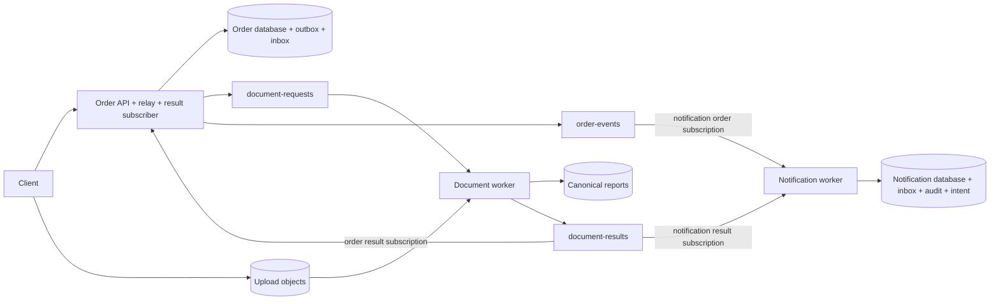

# Phase 19 — Interview preparation

Use this guide to explain the implemented project, defend its decisions, and reason through failures. The
[architecture review](architecture-review.md) and [ADRs](adr/README.md) are the evidence base. The
[mock interview](interview-practice.md) provides prompts to attempt before reading its answer guide.

## A one-minute project introduction

> This is a Java 21 and Spring Boot order-document processing platform for a B2B workflow. An authenticated tenant
> creates an order, registers a document, uploads directly to object storage, and explicitly confirms the upload.
> Processing then happens asynchronously: a worker validates bounded PDF metadata, calculates a checksum, and stores
> a canonical JSON report. The order service receives the result, and a separate notification service records audit
> and notification intent.
>
> The main design problem is consistency across PostgreSQL, Pub/Sub, and object storage. I use a transactional outbox
> for publication, transactional inboxes for SQL consumers, and a create-only canonical report for processor retries.
> That makes duplicate delivery recoverable without claiming a distributed transaction or exactly-once execution.
>
> The repository includes GKE and Cloud Run deployment definitions, reviewed release workflows, and local failure and
> restore tests. Cloud deployment, measured production capacity, and managed disaster recovery remain acceptance work.

Adapt the first-person wording to your actual contribution. Do not present generated assistance, a local exercise, or
unperformed cloud operations as employment experience, production ownership, or a customer outcome.

## A five-minute architecture walkthrough

| Time | Explain | Draw or point to |
| --- | --- | --- |
| 0:00–0:45 | Tenant-scoped orders; direct upload followed by explicit completion; metadata processing, not OCR | Client → order API; client → upload bucket |
| 0:45–1:30 | Order API, continuous relay/subscriber on GKE; bounded push consumers on Cloud Run | Three service boxes with their data ownership |
| 1:30–2:30 | Order mutation/outbox transaction, leased publication, canonical report, result inbox/effect transaction | Three distinct commit boundaries |
| 2:30–3:30 | Lost responses, duplicate publication, report-before-publish crash, stale results | One failure between each boundary |
| 3:30–4:15 | Tenant authorization, separate identities, generation-pinned storage, private SQL and connection budgets | Trust boundaries and shared SQL instance |
| 4:15–5:00 | Test evidence, retained replay state, partial deployment rollback, remaining cloud proof | One measured result and one unresolved launch requirement |

Draw this from memory, then label the two result subscriptions explicitly:



Order and notification databases are logically separate on one configured Cloud SQL instance. Arrows do not mean
shared transactions. The client obtains upload authorization from the API before writing to storage.

## Technical questions and answer outlines

### 1. Why use an outbox instead of publishing in the order transaction?

The database and broker do not commit together. A direct publish after commit can lose an event if the process crashes;
a publish before commit can expose an order that rolls back. The outbox stores the mutation and event atomically in SQL.
A relay claims a short lease, commits, publishes, and then marks the row using the current claim token and lease expiry.
A crash after publication can duplicate the event, so the event ID stays stable and consumers deduplicate it.

Follow-up: putting `@Transactional` on a method does not enlist Pub/Sub or GCS in its database transaction. See
[ADR 002](adr/002-transaction-and-delivery.md) and the lease/crash cases in `MessagingIT`.

### 2. How do you prevent two replicas from executing the same API request?

The idempotency identity includes tenant, operation, and key. The implementation acquires a PostgreSQL transaction-scoped
advisory lock for the key, then compares the canonical request hash with any stored response. Same input returns the
saved resource/response; changed input gets 409. The business write and response record share the transaction. The
full identity remains the primary key; a hash collision can serialize unrelated work but does not merge its identity.

Follow-up: the recorded expiry is not an active purge policy. Replay protection remains while the row is retained.
Do not describe it as a guaranteed automatic 24-hour key reset. Registration retry reuses the registration and can issue
new authorization only within its original upload window.

### 3. How do consumer inboxes avoid a “marked processed but no effect” gap?

The inbox insert and business mutation commit together. If processing fails, both roll back. The transport acknowledges
after the transactional handler returns through its Spring proxy. A lost ACK can cause another delivery, but the unique
consumer/event key suppresses the already committed effect. An inbox write committed separately before the effect would
create a loss window. See `DocumentResultHandler`, `ResultReceiver`, and `NotificationHandler`.

Follow-up: explain the proxy boundary rather than claiming every call to an annotated method is automatically intercepted.
The result receiver calls a separate transactional Spring bean; the same-object self-invocation caveat is not its ACK boundary.

### 4. Why does the document processor not need an inbox database?

Its durable result authority is a create-only canonical report keyed by tenant and processingRequestId. A retry reads
that report before processing the input. Concurrent workers reuse the winning report, which retains a stable result event
ID and outcome. Publication happens after the report exists and before ACK. If publication fails, retry republishes from
the canonical object, even if the input has subsequently disappeared. See [ADR 003](adr/003-canonical-document-results.md).

Follow-up: a new result UUID on every retry would defeat downstream event deduplication. Deleting the report invalidates
this recovery assumption. Storage outages are retryable failures, not automatically terminal invalid-document results.

### 5. Why pin the input generation, and what stops a stale result?

An object name alone does not identify immutable bytes. Completion records the observed generation; processing reads
that exact generation. A processingRequestId identifies the attempt, while eventId identifies an event. The result
handler checks attempt identity and processor version, and the domain accepts a result only for the current QUEUED
attempt. A late result cannot overwrite a newer attempt or a terminal state.

Follow-up: the domain supports reprocessing, but no public/admin reprocessing workflow is implemented. A future operation
must authorize the caller and atomically create a new attempt and request outbox event.

### 6. Why are there separate result subscriptions?

The order and notification consumers both need every applicable result. They therefore have independent subscriptions.
Sharing a subscription would distribute delivery work between consumers instead of providing independent consumption
state. Ordering is not assumed globally. Notification records an audit history, not an authoritative latest-state projection.

Follow-up: explain how a notification outage can lag without preventing order result application, while both still share
some infrastructure and failure risks. Independent subscriptions are not complete infrastructure isolation.

### 7. Why mix GKE and Cloud Run?

The order process includes continuous relay/subscriber work as well as HTTP. The other services do bounded request-scoped
processing. The runtime split fits those execution models but introduces two deployment/networking models. Order API
scaling also scales its workers. Split those workers if measured API demand and backlog pressure need independent scaling.

Follow-up: a modular monolith or all-GKE design could be simpler for a small team. Defend this project's explicit runtime
and ownership boundaries, not a universal claim that microservices or mixed runtimes are always better.

### 8. Does separate data ownership mean separate failure domains?

No. The services have separate databases/users, migrations, and ownership, but one SQL instance shares CPU, storage,
connection limits, maintenance, and outages. Document-service has no database adapter. The shared Java jars contain
contracts and telemetry, not shared persistence entities. See [ADR 005](adr/005-data-and-module-ownership.md).

Follow-up: the design is pragmatic rather than strict hexagonal architecture. Order domain objects use persistence
annotations, and application workflows refer to concrete repositories. Do not claim every dependency points through a port.

### 9. How do you prevent tenant data leakage?

Validate the JWT and derive tenant identity from its claims; require operation scopes, then use tenant-qualified resource
queries and locks. A UUID or valid token for another tenant is insufficient. Only issue signed storage capabilities after
resource authorization. Keep runtime, push, and signing identities separate, with scoped IAM grants.

Follow-up: bucket IAM is not per-tenant business authorization. Signed URLs remain bearer capabilities until expiry,
and signing permission remains powerful. Application JWT checks and Cloud Run invocation IAM protect different boundaries.
Swagger/OpenAPI routes are currently anonymous at the application layer; `/livez` and `/readyz` expose only status, and
other Actuator paths are denied. Real IAM and ingress behavior still needs cloud validation.

### 10. What fails first when throughput increases?

Do not guess a capacity number. Measure API latency, SQL waits, pool pressure, worker memory, and outbox/subscription age.
The order rollout estimate is `(2 × 4 + 1) × 5 = 45` connections against a 50-connection service budget. Two overlapping
notification revisions at four instances and five connections each suggest 40 connections; runtime user limits still
need enforcement. The shared configured maximum is 200, with administrative headroom required.

Follow-up: configured instance limits and formulas are planning assumptions, not hard global bounds. More threads or
connections can worsen a saturated database. The supplied closed-loop local workload reduces offered load as latency rises;
it cannot establish open-loop overload behavior or sustained cloud capacity.

### 11. How do you deploy and roll back safely?

Verify and scan the built images, publish their digests with a run-bound manifest, and promote those same digests. Review
the saved Terraform plan and rendered Helm values before the configured environment gate. Apply checks the plan hash and
target/run binding; stale state fails. External branch protection, reviewers, WIF trust, and runner restrictions must exist.

Follow-up: Terraform applies Cloud Run before Helm updates GKE. This is not an atomic release. Helm `--atomic` only covers
its own release. A rollback is another reviewed deployment of a retained compatible release; it cannot undo incompatible
schema changes or already emitted events. Provenance validation is not a signed image attestation.

### 12. Why is a successful database restore insufficient?

The restored SQL state may be behind messages already acknowledged or canonical objects already created. The configured
seven-day acknowledged-message retention enables a reviewed replay window after it is applied, but it cannot recover
messages already discarded. Restore into an isolated instance, reconcile registrations/reports/inboxes, and preserve IDs
during replay. Missing post-restore registrations may require business reconciliation rather than repeated delivery.

Follow-up: local logical dumps restore into temporary databases and do not test managed PITR, a common cross-database
checkpoint, or regional recovery. No production RPO/RTO has been established. See [production recovery](production.md).

## Code tour: seven stops

| Stop | File | Explain without reading every line |
| --- | --- | --- |
| 1 | [OrderWorkflows](../services/order-service/src/main/java/com/synechisveltiosi/platform/order/application/OrderWorkflows.java) | Which SQL mutations and events share a commit |
| 2 | [IdempotentRequests](../services/order-service/src/main/java/com/synechisveltiosi/platform/order/application/IdempotentRequests.java) | Absent-key race, request fingerprint, retained response |
| 3 | [OutboxStore](../services/order-service/src/main/java/com/synechisveltiosi/platform/order/adapter/persistence/OutboxStore.java) | SKIP LOCKED claim and claim-token fencing |
| 4 | [OutboxRelay](../services/order-service/src/main/java/com/synechisveltiosi/platform/order/adapter/messaging/OutboxRelay.java) | Publication outside SQL; duplicate-producing failure window |
| 5 | [DocumentProcessor](../services/document-service/src/main/java/com/synechisveltiosi/platform/document/application/DocumentProcessor.java) | Existing canonical result before input read; create then publish |
| 6 | [DocumentResultHandler](../services/order-service/src/main/java/com/synechisveltiosi/platform/order/application/DocumentResultHandler.java) | Inbox/effect transaction and stale-attempt rejection |
| 7 | [MessagingIT](../services/order-service/src/test/java/com/synechisveltiosi/platform/order/MessagingIT.java) | How failure injection demonstrates the guarantee |

Use the [ADRs](adr/README.md) for alternatives and consequences. Use the [architecture review](architecture-review.md)
for unresolved findings. Do not describe passing source-reference checks as proof of runtime isolation.

## Demonstration plan

Prepare JDK 21, Docker, and the local environment before the interview. Do not improvise cloud provisioning on a call.
These commands create local test records and objects; the restore drill creates and then removes isolated database copies.

```sh
./scripts/local/up.sh
python3 scripts/local/regression.py
python3 scripts/production/load.py --local --count 6 --concurrency 2
python3 scripts/production/restore_local.py
```

Allow time for startup/builds; they are not part of a five-minute explanation. The startup script runs the smoke workflow.
Show its retry/upload/report/notification result, then one relevant regression or code test. Keep credentials, signed URLs,
and raw database/customer payloads off the shared screen. The load and restore tools emit aggregate reports.

If Docker is unavailable, use the code tour and recorded evidence; say the live demo was not run. Do not substitute a
static report for a claimed live result. The full verification command is `./mvnw -B -ntp verify` when time permits.

## Evidence and phrasing discipline

| Defensible statement | Qualification to include |
| --- | --- |
| “The Phase 18 Maven run passed 107 tests.” | Zero failures/errors/skips in that recorded run; this guide does not rerun it |
| “The release pipeline has vulnerability gates.” | Workflow implemented and locally checked; publication/scanning was not executed against the configured release environment |
| “I tested local replay and logical restore behavior.” | Emulators and local PostgreSQL; no claim of real IAM, managed PITR or regional failover |
| “Twenty local 64 KiB workflows passed at concurrency two.” | Small closed-loop sample, 10.81 seconds; not a production throughput benchmark |
| “The design uses at-least-once delivery with idempotent effects.” | Requires preserved inbox/canonical state and compatible consumers |
| “The system records notification intent.” | No email/SMS provider or proof of external delivery |
| “The implementation propagates trace context.” | Log/event correlation, not exported tracing spans |

Avoid “production-ready,” “zero data loss,” “exactly once,” “unlimited scaling,” “automatic expiry,” or “atomic rollback”
unless you immediately narrow the statement to something the implementation and evidence support.

A portfolio description can say: “Implemented a Java order-document workflow with transactional outbox/inbox recovery,
generation-pinned object processing, and local duplicate/failure tests; authored GCP deployment and reviewed release
workflows.” Use only contributions you can personally explain. Do not invent cost savings, customer scale, incident
history, or business impact.

For a technical challenge story, use the publish/commit gap or report-before-publish crash: state the failure window,
explain why a naive retry duplicates effects, show the stable identity and durable record, and point to the test. For an
improvement story, explain the Phase 18 health-route/test mismatch, the narrow security fix, and the subsequent test run.
Neither story needs a fictional production outage.
