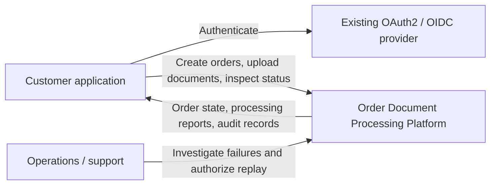
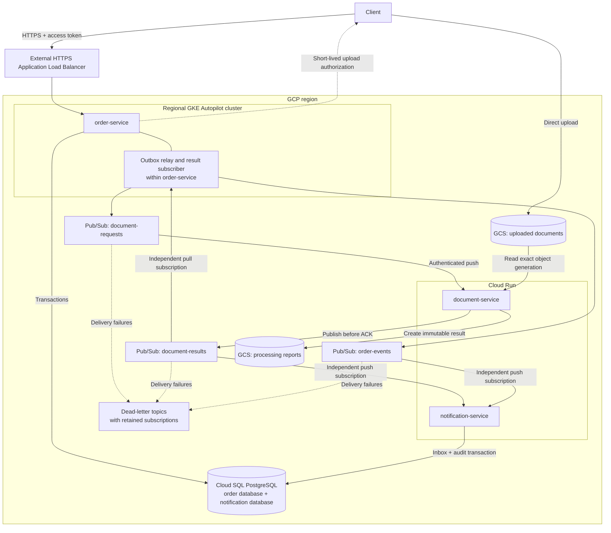
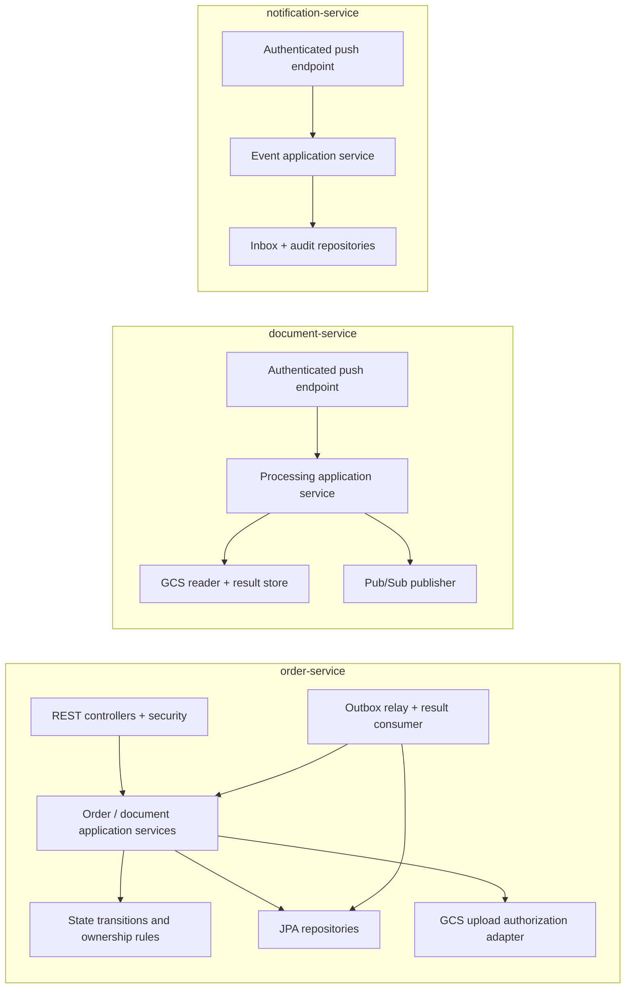
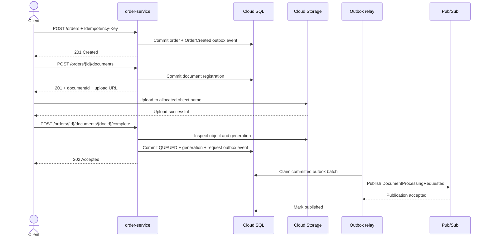
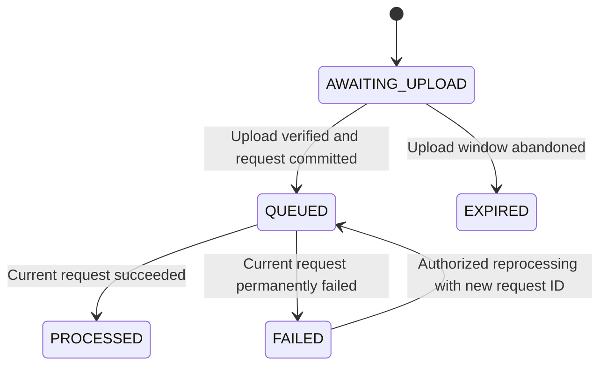
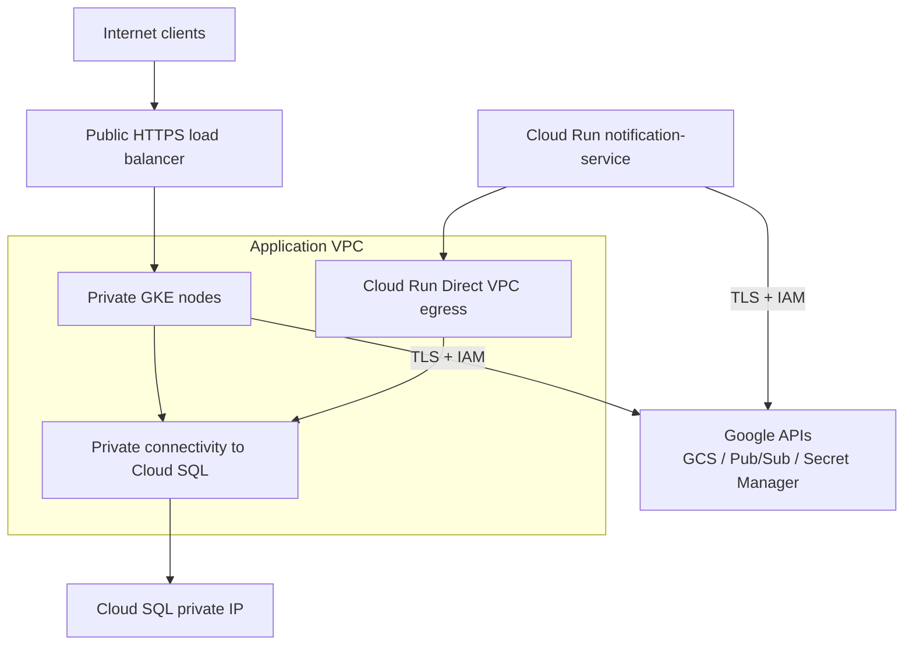

I’ll read `HELP.md` and the repository guidance, then define the architecture and reliability boundaries for Phase 1.
I’ll verify the relevant GCP and Spring platform details against official documentation.

# Phase 1 — Architecture

## 1. Business use case

We will build an **Order Document Processing Platform** for a B2B supplier.

Customers create orders and attach purchase orders, invoices, or delivery documents. The platform validates uploaded
documents, extracts technical metadata, stores processing results, updates the order’s document status, and creates an
independent audit/notification record.

The initial processor will perform **bounded metadata processing**: file-type validation, size validation, checksum
calculation, and generation of a JSON processing report. OCR, malware scanning, and financial interpretation require
additional capabilities and are outside the initial implementation.

Your existing `pom.xml` already selects **Java 21 and Spring Boot 4.1.1**. We will retain that baseline; the official
requirements identify Spring Framework 7.0.9 or newer for that Boot
release. [Spring Boot requirements](https://docs.spring.io/spring-boot/system-requirements.html)
This phase establishes the design. Repository restructuring and code begin after `NEXT`.

---

## 2. Requirements and consistency guarantees

### Functional requirements

1. Create and retrieve customer orders.
2. Register documents against an authorized order.
3. Upload document bytes directly to GCS.
4. Explicitly confirm an upload before scheduling processing.
5. Process documents asynchronously.
6. Expose document processing status and results.
7. Record relevant domain events independently.
8. Support safe retries and controlled replay.

### Initial operating assumptions

These are design inputs, not measured capacity claims.

| Area              | Initial assumption                                                  |
|-------------------|---------------------------------------------------------------------|
| Deployment        | One GCP region; production workloads distributed across zones       |
| Customers         | Tenant-scoped access derived from authenticated identity            |
| Document size     | Up to 25 MiB initially                                              |
| Processing        | Bounded work designed to finish within one push request             |
| API behavior      | Synchronous persistence; asynchronous document processing           |
| Availability      | Regional application resilience and Cloud SQL HA in production      |
| Disaster recovery | Backups and restore procedures; no initial active-active deployment |
| Load              | Start with a modest workload; validate capacity through load tests  |

### Guarantees

- **Order changes and their outbox events commit atomically.**
- **Pub/Sub publication and delivery can produce duplicates.**
- **Each database consumer commits its inbox record and business effect together.**
- **GCS writes and SQL transactions are separate consistency boundaries.**
- **Processing results become visible in the Order API eventually.**
- **No global ordering or end-to-end exactly-once execution is assumed.**

Pub/Sub defaults to at-least-once delivery without ordering guarantees. Its exactly-once delivery feature does not apply
to push subscriptions and would not make GCS and PostgreSQL one
transaction. [Subscription overview](https://docs.cloud.google.com/pubsub/docs/subscription-overview), [Exactly-once delivery](https://docs.cloud.google.com/pubsub/docs/exactly-once-delivery)

---

## 3. System context



The identity provider is an external dependency. We will configure Spring Security as an OAuth2 resource server and
enforce issuer, audience, scopes, and tenant ownership.

An authenticated user must still be authorized to access the particular order or document.

---

## 4. Service and deployment architecture



**Pub/Sub topics fan out through separate subscriptions.** The Order API and notification service must not share a
subscription: sharing would distribute messages between them rather than deliver each event to both.

Cloud Logging, Monitoring, Secret Manager, IAM, and Artifact Registry support all three services and are omitted from
the diagram for readability.

### Service responsibilities

| Service                | Target        | Owns                                                                                               | Does not own                           |
|------------------------|---------------|----------------------------------------------------------------------------------------------------|----------------------------------------|
| `order-service`        | GKE Autopilot | Orders, document registrations, status transitions, upload authorization, SQL outbox, result inbox | Document-byte processing               |
| `document-service`     | Cloud Run     | Validation, streaming checksums, immutable processing reports, result publication                  | Order tables or customer authorization |
| `notification-service` | Cloud Run     | Consumer inbox, audit records, durable notification records                                        | Order lifecycle decisions              |

**Notification scope:** the first implementation records notification intent and audit history. Actual email/SMS
delivery would introduce an external provider and another durable delivery workflow; a database record will not be
presented as proof that a message reached a customer.

---

## 5. Component architecture



We will use ports where they isolate meaningful external dependencies—event publishing, object storage, and
processing—not create an interface for every class.

Shared modules will contain event contracts and observability support. They will not contain shared JPA entities or
shared domain repositories.

---

## 6. Request flow: register, upload, confirm

A critical correction to the simplified flow is that **order creation does not mean document bytes exist**.



### API outline

| Endpoint                                                        | Purpose                                        | Success |
|-----------------------------------------------------------------|------------------------------------------------|---------|
| `POST /api/v1/orders`                                           | Create an order                                | `201`   |
| `GET /api/v1/orders/{orderId}`                                  | Retrieve current state                         | `200`   |
| `PATCH /api/v1/orders/{orderId}/status`                         | Apply an authorized, valid business transition | `200`   |
| `POST /api/v1/orders/{orderId}/documents`                       | Register a document and authorize upload       | `201`   |
| `POST /api/v1/orders/{orderId}/documents/{documentId}/complete` | Verify upload and enqueue processing           | `202`   |
| `GET /api/v1/orders/{orderId}/documents/{documentId}`           | Inspect processing state                       | `200`   |

Errors will use RFC 9457 Problem Details. Idempotency keys will be scoped to tenant and operation, associated with a
request fingerprint, and protected by database uniqueness constraints. Reusing a key with different input produces
`409 Conflict`.

### Upload safeguards

- Server-generated object names; the client cannot choose arbitrary bucket paths.
- Short-lived upload authorization.
- Create-only upload semantics.
- Verification of actual size and object metadata before enqueueing.
- Processing bound to the exact GCS object generation.
- Processor-side validation of bytes; client-provided content type is untrusted.
- A recovery path for expired upload authorization.
- Cleanup of abandoned registrations and unreferenced objects.

Signed URLs are bearer capabilities. We will avoid logging them and use IAM signing rather than private-key files. GCS
generation preconditions protect operations against unintended overwrites and
races. [Signed URLs](https://docs.cloud.google.com/storage/docs/access-control/signed-urls), [Request preconditions](https://docs.cloud.google.com/storage/docs/request-preconditions)

---

## 7. Event flow and reliability

### Topics and consumers

| Topic               | Events                                          | Subscriptions                 |
|---------------------|-------------------------------------------------|-------------------------------|
| `order-events`      | `OrderCreated`, `OrderStatusChanged`            | Notification push             |
| `document-requests` | `DocumentProcessingRequested`                   | Document push                 |
| `document-results`  | `DocumentProcessed`, `DocumentProcessingFailed` | Order pull; notification push |

Each subscription receives its own retry policy and dead-letter configuration.

Events include:

```json
{
  "eventId": "uuid",
  "eventType": "DocumentProcessingRequested",
  "eventVersion": 1,
  "aggregateId": "order-uuid",
  "correlationId": "uuid",
  "causationId": "uuid",
  "occurredAt": "ISO-8601 timestamp",
  "source": "order-service",
  "data": {
    "documentId": "uuid",
    "processingRequestId": "uuid",
    "bucket": "configured-upload-bucket",
    "objectName": "server-generated-path",
    "generation": "immutable-object-generation",
    "processorVersion": "1"
  }
}
```

The envelope will also carry tenant context where needed. Consumers validate source, type, version, and allowed
bucket/path values.

Trace context will travel through message attributes; correlation IDs remain useful even when a trace is sampled out.

### A. SQL-to-Pub/Sub: transactional outbox

The order transaction writes the business change and outbox row together.

The relay:

1. Claims eligible rows using short transactions and expiring leases.
2. Publishes outside the database transaction.
3. Marks successful publication using the claim token.
4. Reschedules failures using bounded exponential backoff and jitter.

A crash after publication but before marking success causes duplicate publication. **The event ID remains unchanged
across retries.**

Polling is the initial choice because it is operationally understandable. CDC becomes attractive when polling latency or
database load becomes material.

### B. Document processing: durable result before acknowledgment

The document service remains free of a SQL dependency:

1. Validate the request.
2. Look for a result at a deterministic key derived from `processingRequestId`.
3. If absent, read the specified input generation and process it.
4. Create an immutable result object using a create-only precondition.
5. If another worker already created it, read that winning result.
6. Publish the canonical result event reconstructed from stored metadata and that object's generation.
7. Return success only after Pub/Sub accepts publication.

This handles the **GCS write succeeded, publication failed** window. Redelivery reads the stored result and republishes
the same event. The report stores the stable result event ID, timestamp, request identity, and outcome. Its own GCS
generation is only known after creation, so the publisher combines that generation with the stored metadata rather
than trying to embed an object's generation inside itself before it exists.

Concurrent workers may duplicate computation, but they converge on one persisted result. This design is appropriate for
deterministic metadata processing. It would need stronger orchestration for payments or other external side effects.

A crash after publication but before HTTP acknowledgment still produces duplicate result events.

### C. Result and notification consumers: transactional inbox

For each database consumer:

```text
BEGIN
  Insert unique (consumerName, eventId)
  Apply business change or append audit record
COMMIT
ACK
```

The unique insert resolves concurrency; a separate “lookup then insert” is insufficient.

A rollback removes both the inbox insert and business change. An acknowledgment failure after commit causes harmless
redelivery.

### Failure classification

| Failure                                         | Behavior                                                           |
|-------------------------------------------------|--------------------------------------------------------------------|
| Invalid document bytes                          | Persist and publish a terminal failure result                      |
| Temporary GCS/Pub/Sub failure                   | Fail the request; allow redelivery                                 |
| Unsupported/malformed event                     | Retry through a bounded delivery policy, then dead-letter handling |
| Duplicate completed request                     | Reuse canonical result                                             |
| Stale result from an earlier processing request | Do not overwrite the current document state                        |

Dead-letter delivery requires monitoring, retained subscriptions, correct IAM, and an explicit replay runbook. Retry
exhaustion must not silently become a successful business outcome.

---

## 8. State and data ownership

### Document lifecycle



We will not initially expose `PROCESSING`: without a durable started event or renewable lease, that state can become
stale after a worker crashes.
`QUEUED` therefore means accepted and awaiting a terminal result, including work currently executing.

Order business status and document processing status remain separate. Processing a PDF must not implicitly mean an order
is approved or fulfilled.

### Database boundaries

One Cloud SQL instance initially hosts separate logical databases and database users:

- **Order database:** orders, documents, API idempotency, outbox, result inbox.
- **Notification database:** inbox, audit, notification records.
- **Document service:** GCS reports; no SQL access.

No cross-service SQL joins or foreign keys.

Sharing the physical instance reduces baseline cost but shares capacity, maintenance, and outage risk. Separate
instances become appropriate when isolation or independent scaling justifies the expense.

---

## 9. Why these GCP services exist

| Service                        | Purpose and choice                                                      | Scaling, failures, security, and cost trade-offs                                                                                                                                              |
|--------------------------------|-------------------------------------------------------------------------|-----------------------------------------------------------------------------------------------------------------------------------------------------------------------------------------------|
| **GKE Autopilot**              | Hosts the API plus continuously running relay and streaming subscriber  | Pod scaling and placement control; scheduling and rollout failures remain operational concerns. Workload Identity and resource limits required. Higher baseline cost than a scale-to-zero API |
| **Cloud Run**                  | Hosts bounded document processing and independent notification requests | Request-driven scaling; cold starts, concurrency, and downstream saturation require tuning. Per-service identity and instance caps                                                            |
| **Cloud SQL PostgreSQL**       | Transactions, relational constraints, inbox/outbox persistence          | Finite connections, write throughput, locks, and failover interruptions. Private connectivity, backups, HA. Persistent baseline cost                                                          |
| **Pub/Sub**                    | Durable asynchronous delivery and independent fan-out                   | Backlog absorbs bursts, but consumers and retention remain bounded. Duplicates and poison messages require explicit handling. Cost grows with traffic and fan-out                             |
| **GCS**                        | Document bytes and immutable reports                                    | Streaming avoids heap growth. Orphans, object-version mistakes, and retention misconfiguration matter. Private buckets, lifecycle rules, operation/storage/egress costs                       |
| **Artifact Registry**          | Stores deployable container artifacts                                   | Deploy by digest; separate writer and reader permissions. Retention limits storage growth; unavailable artifacts can block new deployments                                                    |
| **IAM / Workload Identity**    | Workload authentication without static keys                             | Narrow resource permissions; incorrect bindings cause runtime outages. Separate deployer and runtime identities                                                                               |
| **Secret Manager**             | Stores database credentials and other application secrets               | Versioned rotation; restricted per-secret access. Startup and rotation failures require operational handling                                                                                  |
| **Cloud Logging / Monitoring** | Central logs, metrics, dashboards, alerts                               | Control cardinality, sampling, and retention. Exclude document content, credentials, and signed URLs                                                                                          |

Alternatives include an all-Cloud-Run deployment for simpler operations, an all-GKE deployment for an established
Kubernetes platform, self-managed PostgreSQL for unusual database requirements, and Kafka where partition control and
replay-oriented streaming justify operating a different platform.

GCS is **Google Cloud Storage**, not AWS S3. Local tests will use a GCS-specific fake; an S3-compatible emulator does
not validate GCS generation or signing behavior.

---

## 10. GKE versus Cloud Run

| Dimension         | GKE                                                         | Cloud Run                                        |
|-------------------|-------------------------------------------------------------|--------------------------------------------------|
| Operations        | Kubernetes workloads, policies, upgrades, capacity behavior | Managed request execution and revisions          |
| Autoscaling       | HPA and cluster capacity; configurable workload metrics     | Request concurrency and resource-driven scaling  |
| Background work   | Natural fit for continuous subscribers and polling          | Initial design performs work within the request  |
| Long-running work | Greater scheduling and lifecycle control                    | Must fit the selected execution model and limits |
| Networking        | Pod networking and Kubernetes policy controls               | Managed ingress; configurable VPC egress         |
| Startup           | Pod startup plus possible capacity provisioning             | Cold starts when scaling from zero               |
| Cost              | Provisioned workload baseline                               | Attractive for intermittent request workloads    |
| Deployment        | Deployments, Services, Helm, rolling updates                | Revisions and traffic allocation                 |

**Why keep the Order API on GKE?** Its always-running outbox relay and streaming subscriber fit a persistent workload,
and the exercise explicitly requires GKE. An HTTP-only order API could reasonably run on Cloud Run.

**Why notification on Cloud Run?** It performs a short database transaction per event and needs no continuously running
process. Its maximum instance count will be constrained by database capacity.

Document processing can start with zero minimum instances. A warm minimum is an explicit latency-versus-cost decision.

---

## 11. Network and security boundaries



Cloud Run is a managed service; configuring VPC egress does not turn its ingress endpoint into a pod inside our VPC.

### Identity model

```text
GKE Kubernetes ServiceAccount
    → Workload Identity Federation
    → linked Google service account
        → permitted Pub/Sub topics/subscriptions
        → permitted GCS operations
        → Cloud SQL connectivity
        → specific secrets
```

GKE supports both direct workload-principal grants and service-account impersonation. We will use explicit linked
identities where needed by integrations, without service-account key
files. [GKE Workload Identity](https://docs.cloud.google.com/kubernetes-engine/docs/concepts/workload-identity)

Cloud Run uses a dedicated runtime service account for each service. Pub/Sub push uses a separate invocation identity
with `roles/run.invoker` on the intended service. Production push endpoints will require
authentication. [Push authentication](https://docs.cloud.google.com/pubsub/docs/authenticate-push-subscriptions)

### Database connectivity

Use the Cloud SQL Java connector with private IP and HikariCP. The connector handles authenticated secure connectivity;
it does **not** create a network route. Notification requires Direct VPC egress to reach private
SQL. [Cloud SQL connectivity](https://docs.cloud.google.com/sql/docs/postgres/connect-overview), [Direct VPC egress](https://docs.cloud.google.com/run/docs/configuring/vpc-direct-vpc)

### Optional services

- **API Gateway:** add when API-product concerns justify another layer; initially the load balancer and Spring Security
  serve our needs.
- **Cloud DNS:** useful for a managed application domain.
- **Serverless VPC Access connector:** an alternative when Direct VPC egress does not fit deployment constraints.
- **Cloud Trace:** useful for exported OpenTelemetry traces; correlation survives independently in logs and events.

---

## 12. Operational guardrails

### Database connection budget

Autoscaling must respect:

```text
(order replicas × order pool size)
+ (notification instances × notification pool size)
+ migration/admin allowance
+ rollout and failover headroom
< safe database connection budget
```

The document service contributes **zero database connections**.

HA protects against some zonal failures; it does not remove reconnect behavior or provide regional disaster recovery.
Read replicas will not serve reads requiring immediate visibility after writes.

### Backpressure and recovery

- Bound outbox batch sizes and publication concurrency.
- Bound GKE subscriber outstanding messages and bytes.
- Bound Cloud Run concurrency and maximum instances.
- Stream document bytes; avoid loading entire files into heap.
- Keep processing within a budget below the configured push deadline.
- Use retries only where side effects are idempotent or protected.
- Drain work during shutdown; allow safe redelivery when deadlines expire.
- Reconcile aged `QUEUED` documents against retained results and dead-letter state.

### Observability

The primary operational signals will be:

- API latency and error rate.
- Oldest unpublished outbox age.
- Subscription backlog age and dead-letter arrivals.
- Document time to terminal result.
- Duplicate-event count.
- Database pool wait time and connection use.
- GCS and Pub/Sub latency/error rates.

Raw documents and access credentials must never appear in logs.

---

## 13. Phase decisions and production trade-offs

### Key Points

1. GKE owns transactional order operations and continuous messaging work.
2. Cloud Run handles bounded document and notification requests.
3. Upload completion explicitly gates processing.
4. SQL outbox and inbox transactions protect database consistency.
5. Immutable GCS results make document processing safely repeatable.
6. Independent subscriptions preserve independent consumers.

### Production Considerations

- Regional HA is the initial deployment model; multi-region recovery remains additional work.
- Shared Cloud SQL reduces cost while creating a shared failure boundary.
- Polling adds latency and database work; CDC is a later option.
- Duplicate computation is acceptable for this processor, but not for arbitrary external side effects.
- Local emulators will not prove IAM, signed URL, private networking, or failover correctness.
- Metadata validation is not malware scanning.
- Throughput and latency targets require measurements before production commitments.

### Interview Discussion

**How do you guarantee exactly-once business processing?**  
For a database consumer, the unique inbox record and business mutation commit in one transaction. That guarantees one
committed effect for that consumer and event while the deduplication record is retained. External effects need their own
idempotency mechanism.

**What happens if the worker crashes after writing GCS?**  
Redelivery finds the canonical result, publishes its stable event, and acknowledges only after publication succeeds.

**How do you prevent autoscaling from overwhelming SQL?**  
Set instance and pool limits from a combined connection budget, monitor pool wait time, and let backlog absorb bursts.

**Why not use Kafka?**  
This workflow needs durable delivery and independent consumers. Kafka becomes more compelling when partition ownership,
stream processing, or extensive replay requirements justify its additional platform considerations.

### Interview Takeaway

**The central design skill is identifying each commit boundary and making recovery safe between boundaries.** Managed
services provide infrastructure guarantees; the application still owns business consistency.

**Next: Phase 2 — Repository structure and parent Maven configuration.**

Reply `NEXT` to continue.
